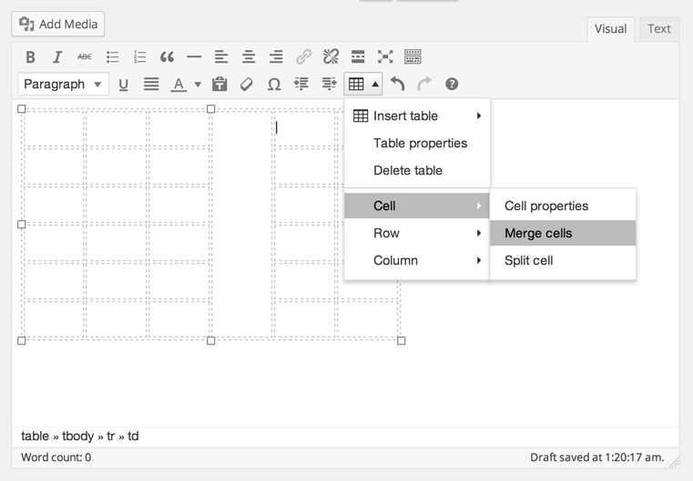

# MCE Table Buttons for WordPress

> Adds table editing controls to the visual content editor (TinyMCE).

   

## Overview

A light weight plug-in that adds the table editing controls from the full version of TinyMCE, optimized for WordPress. Note that this may not work in conjunction with other plug-ins that significantly alter or replace the visual editor's default behavior.

Note that the table controls are contained in the “kitchen sink” toolbar, toggled with the last button on the first row of controls.

## Technical information
* Requires at least WordPress 4.0
* Includes TinyMCE table plugin versions 4.7.11 and 4.1.?

## Installation

1. Install easily with the WordPress plugin control panel or manually download the plugin and upload the folder
`mce-table-buttons` to the `/wp-content/plugins/` directory
1. Activate the plugin through the 'Plugins' menu in WordPress
1. Show the toolbar in the editor by opening the "kitchen sink" (the last button in the first row)

## Support Level

**Stable:** 10up is not planning to develop any new features for this, but will still respond to bug reports and security concerns.  We welcome PRs, but any that include new features should be small and easy to integrate and should not include breaking changes. We otherwise intend to keep this tested up to the most recent version of WordPress.

## Like what you see?

